# 📊 Financial PCA Dashboard

Інтерактивна аналітична система для дослідження фінансово-економічних показників підприємств методом головних компонент (PCA). Розроблено в рамках лабораторної роботи №5 з дисципліни "Методи та засоби аналізу багатовимірних даних".


## 🚀 Функціональні можливості

Додаток дозволяє автоматизувати аналіз багатовимірних даних для 5 різних економічних задач:

* **Автоматичний розрахунок PCA:** Визначення власних чисел, дисперсії та факторних навантажень.
* **Інтерактивна візуалізація:**
    * Карта позиціонування підприємств (Scatter Plot з кластеризацією).
    * Матриці кореляцій та факторних навантажень (Heatmaps).
    * Аналіз вагомості факторів (Scree Plot).
* **Розумні таблиці:** Візуалізація вхідних даних з вбудованими прогрес-барами.
* **Генерація звітів:** Автоматичне створення структурованих текстових висновків на основі розрахунків.

## 📸 Галерея проекту

Система автоматично адаптується під різні набори даних. Нижче наведено повний огляд роботи програми для всіх 5 економічних задач.

### 1. Фондоозброєність (Завдання 1)
*Аналіз ефективності використання обладнання та технічного забезпечення.*
| Вхідні дані (Dashboard) | Карта позиціонування (Scatter) | Фінальний звіт (Auto-Report) |
| :---: | :---: | :---: |
| 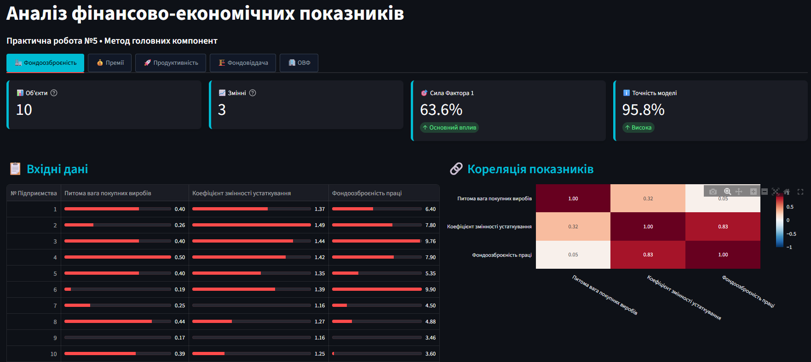 | 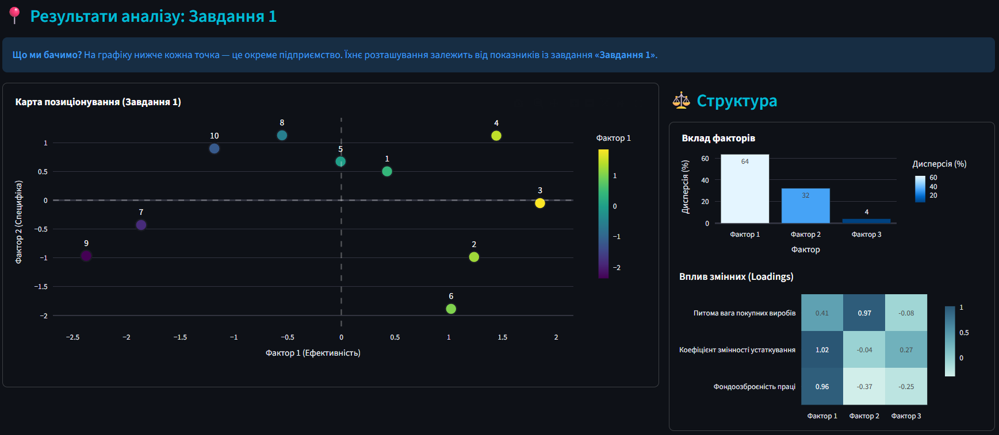 | 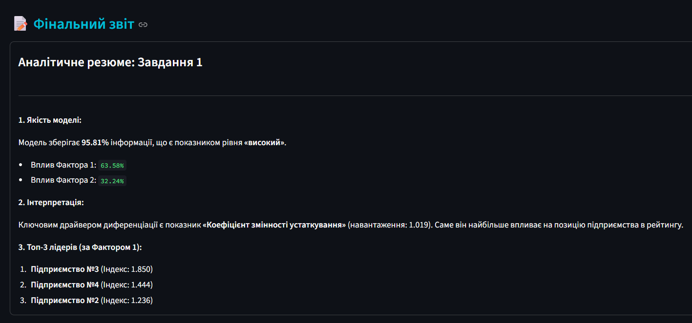 |

### 2. Преміювання та мотивація (Завдання 2)
*Вплив матеріального стимулювання та питомої ваги покупних виробів.*
| Вхідні дані (Dashboard) | Карта позиціонування (Scatter) | Фінальний звіт (Auto-Report) |
| :---: | :---: | :---: |
| 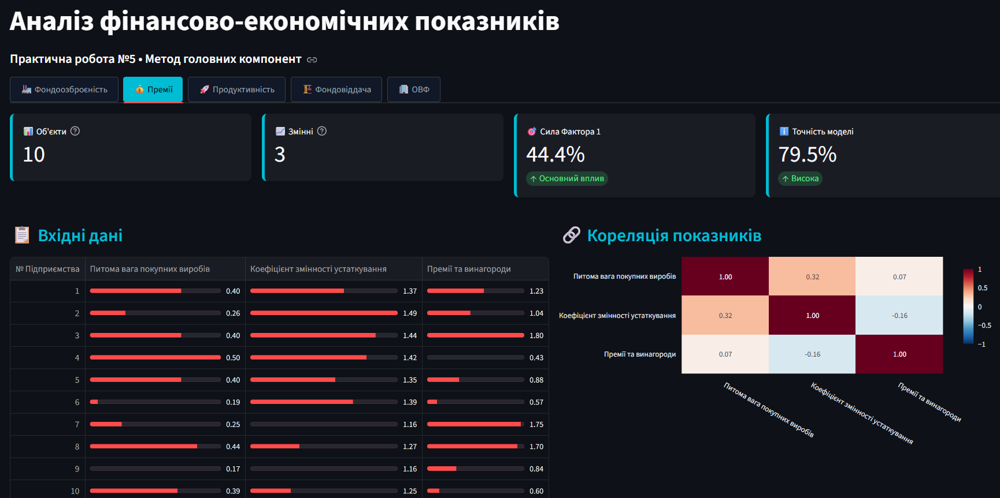 | 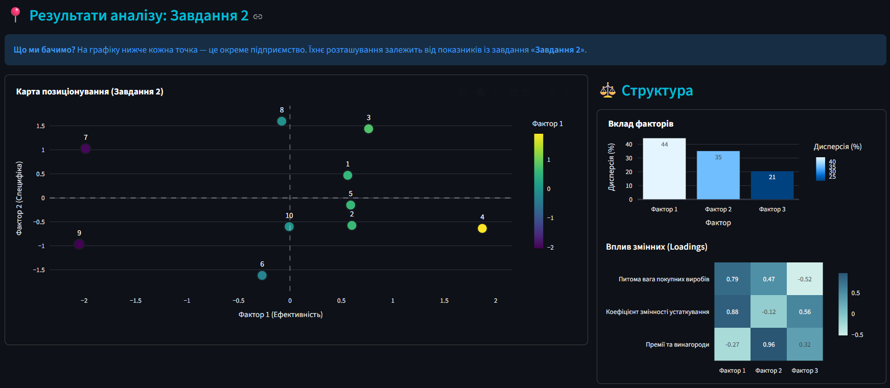 | 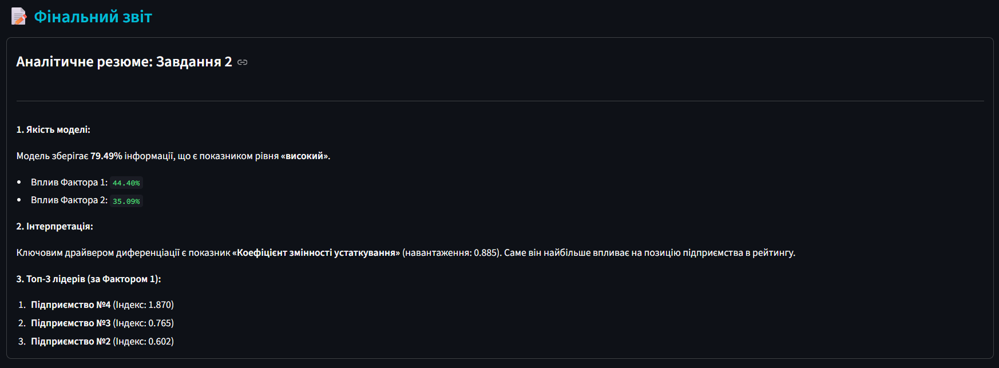 |

### 3. Продуктивність праці (Завдання 3)
*Дослідження факторів, що впливають на виробіток та рентабельність.*
| Вхідні дані (Dashboard) | Карта позиціонування (Scatter) | Фінальний звіт (Auto-Report) |
| :---: | :---: | :---: |
| 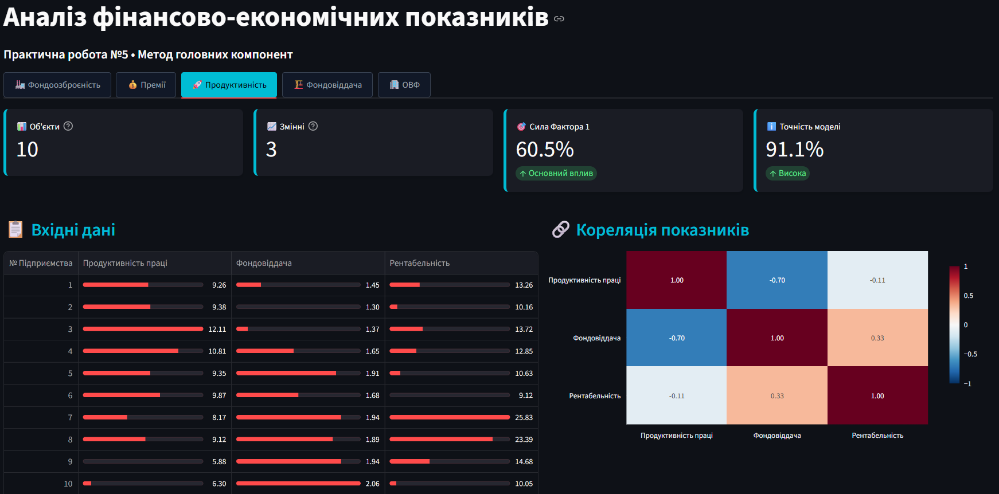 | 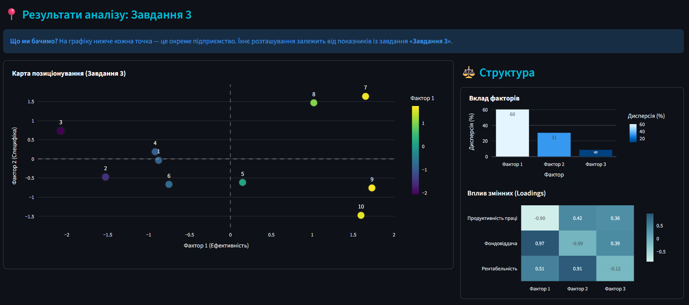 | 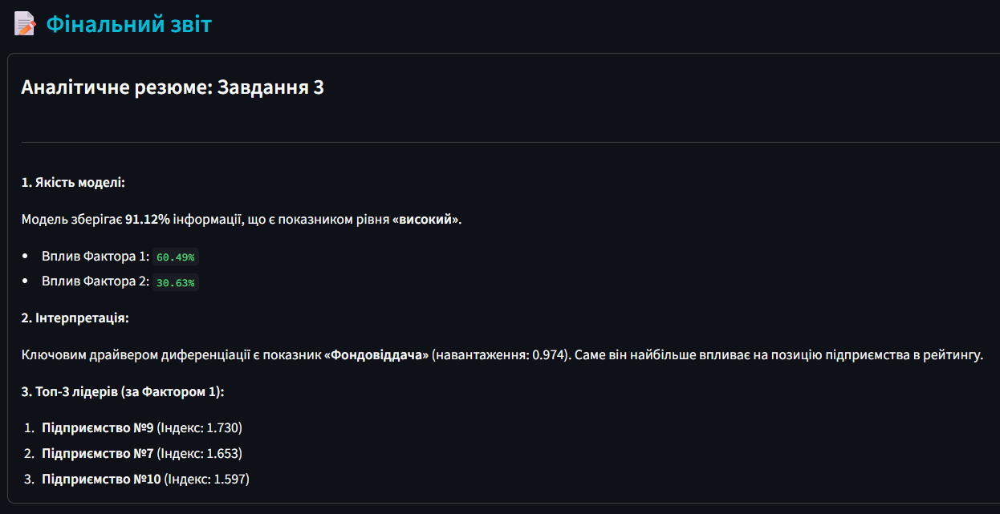 |

### 4. Фондовіддача (Завдання 4)
*Оцінка ефективності використання основних виробничих фондів.*
| Вхідні дані (Dashboard) | Карта позиціонування (Scatter) | Фінальний звіт (Auto-Report) |
| :---: | :---: | :---: |
| 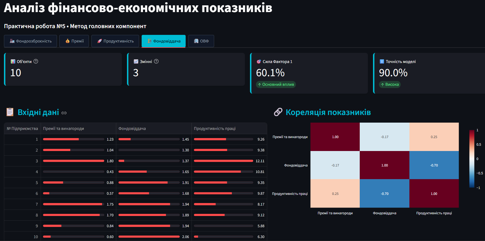 | 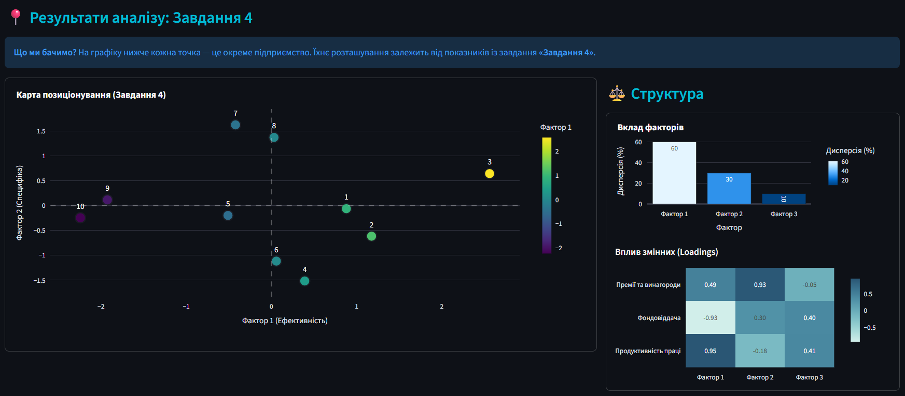 |  |

### 5. Вартість ОВФ (Завдання 5)
*Аналіз структури та середньорічної вартості основних фондів.*
| Вхідні дані (Dashboard) | Карта позиціонування (Scatter) | Фінальний звіт (Auto-Report) |
| :---: | :---: | :---: |
|  | 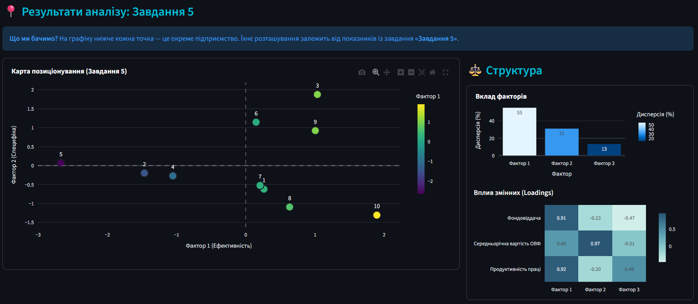 |  |

---

## 📂 Структура проекту (MVC)

Проект побудовано за принципами модульної архітектури для чистоти коду:

```text
pca_dashboard/
├── dashboard.py       # Entry Point: Головний файл запуску
├── app_config.py      # Config: Налаштування сторінки та CSS стилів
├── ui_renderer.py     # View: Відповідає за візуалізацію графіків та таблиць
├── pca_engine.py      # Model: Математичне ядро (PCA алгоритми)
├── report_gen.py      # Logic: Генератор текстових аналітичних звітів
└── data_loader.py     # Data: Завантаження наборів даних
````

## 🛠️ Встановлення та запуск

1.  **Клонуйте репозиторій:**

    ```bash
    git clone https://github.com/Lutvunenko-Dmutro/mda-lab5-pca?tab=readme-ov-file
    cd mda-lab5-pca
    ```

2.  **Встановіть залежності:**

    ```bash
    pip install streamlit pandas plotly scikit-learn
    ```

3.  **Запустіть додаток:**

    ```bash
    streamlit run dashboard.py
    ```

## 📊 Опис завдань

Система містить 5 попередньо завантажених датасетів:

1.  **Фондоозброєність:** Аналіз ефективності використання обладнання.
2.  **Преміювання:** Вплив матеріального стимулювання на виробіток.
3.  **Продуктивність праці:** Аналіз факторів, що впливають на виробіток.
4.  **Фондовіддача:** Оцінка ефективності основних фондів.
5.  **Вартість ОВФ:** Аналіз структури основних виробничих фондів.

## 👤 Автор

**Литвиненко Дмитро**

  * Група: I-23
  * Спеціальність: Програмна інженерія

-----

*Developed with ❤️ using Streamlit*
